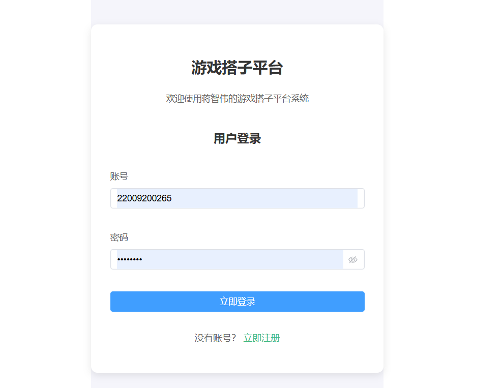
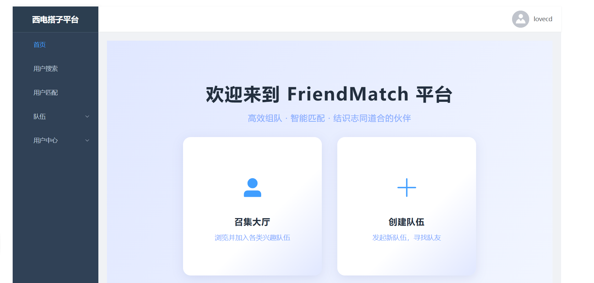
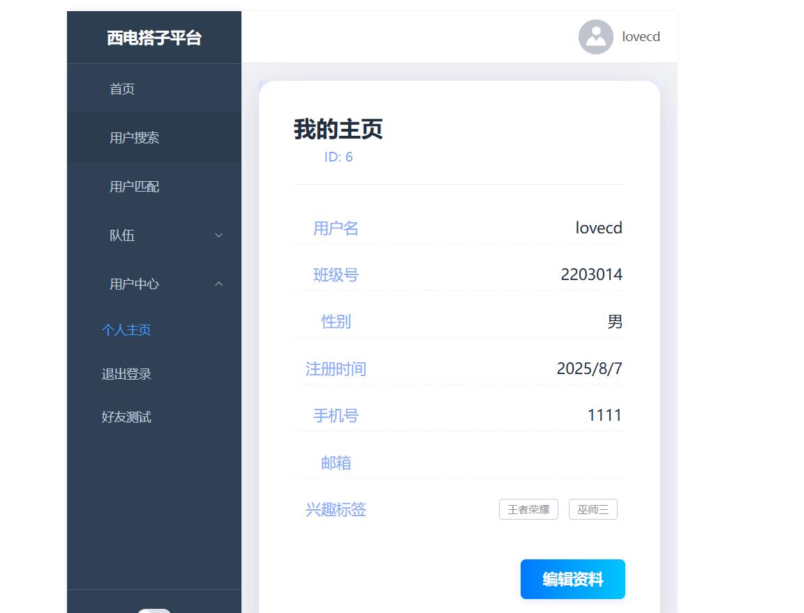
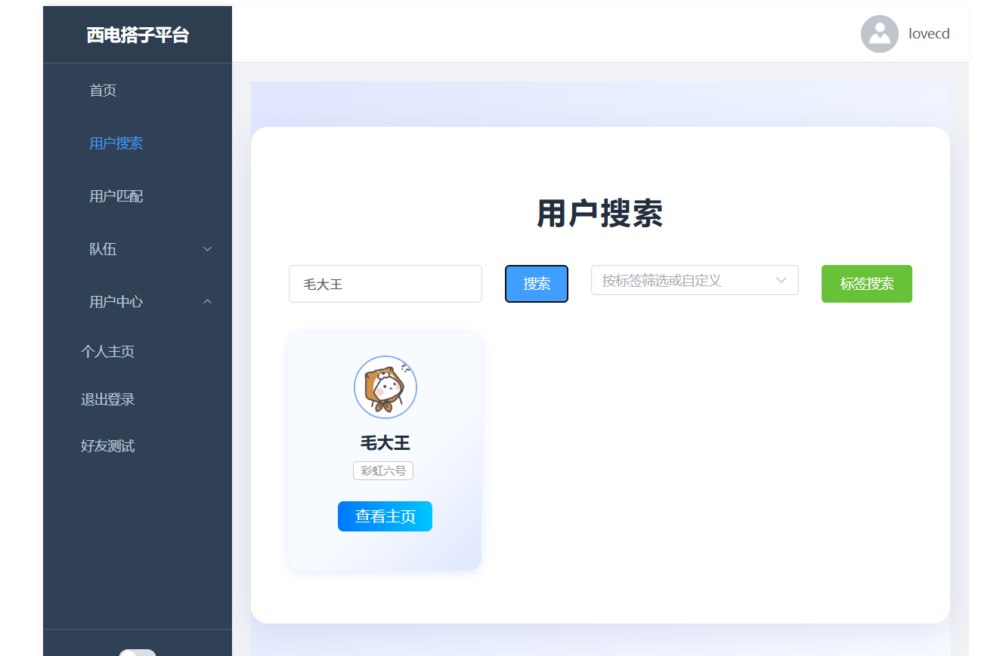
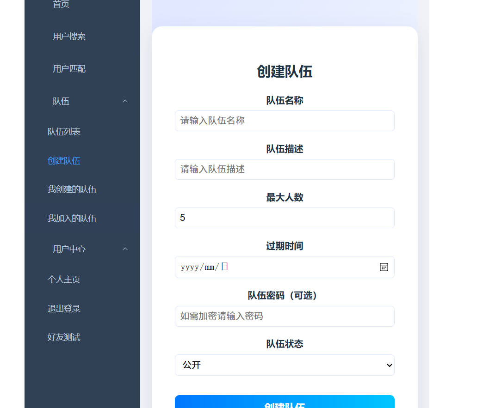
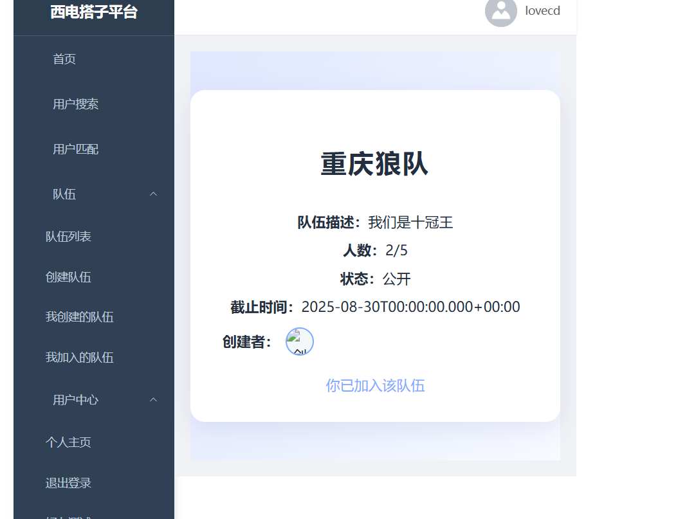

# 西电搭子平台（前端）

## 项目介绍
该项目是西电搭子平台项目的**前端部分**，基于vue+ts+element-plus+axios开发，项目前端主要有登录页面、注册页面、主页面，个人资料页面、个人资料编辑页面，用户查找页面，用户匹配页面，创建队伍页面，查看队伍页面，以及初步的好友功能（待完善）

## 页面展示

- 登录页面

- 主页面

- 个人资料页面

- 用户搜索页面

- 队伍创建页面

- 队伍加入页面

